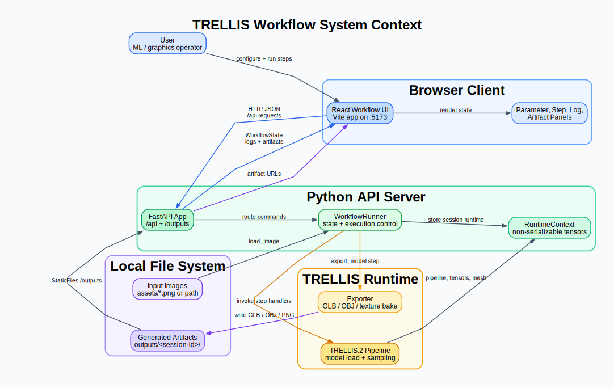
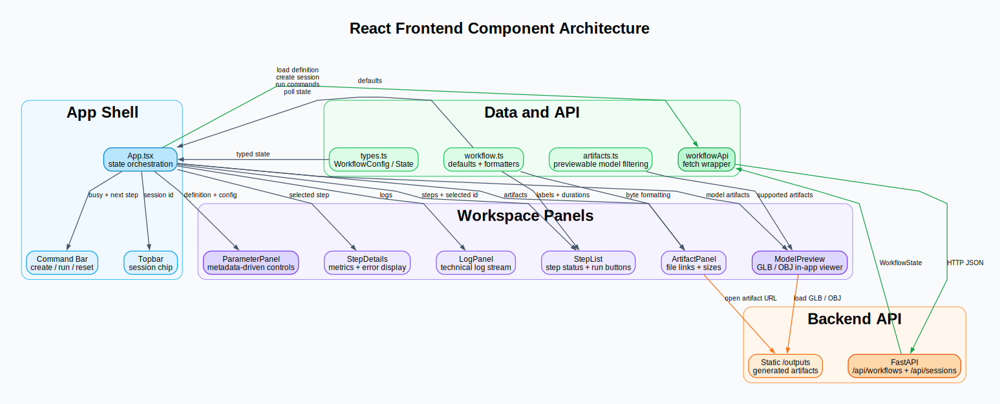
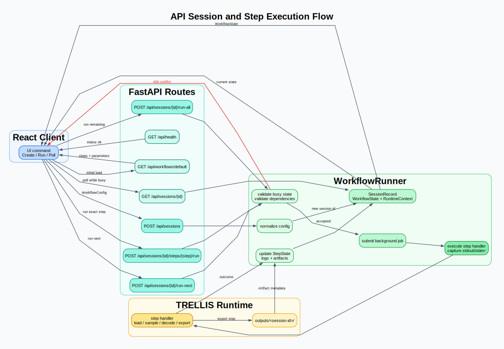
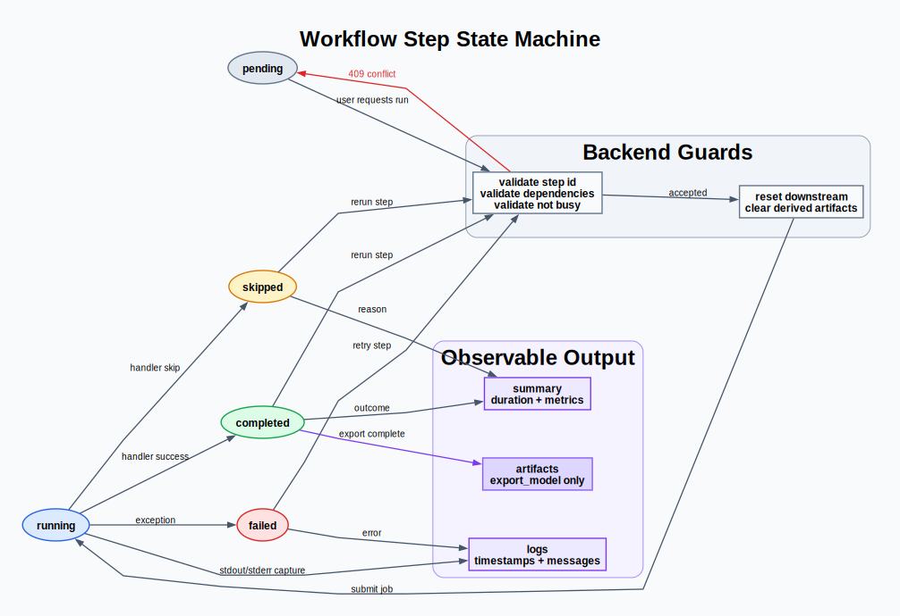
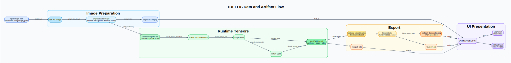
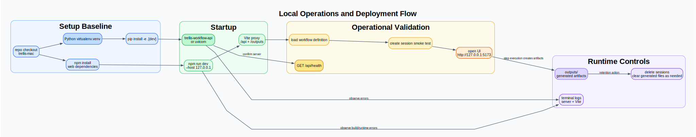
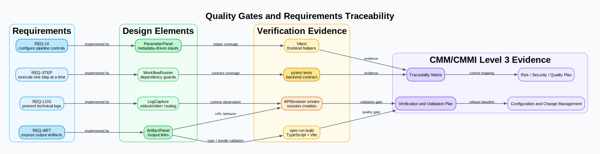
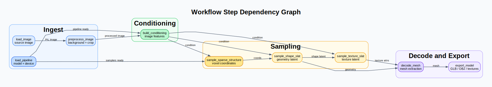

# GraphViz DOT Diagram Set

This folder contains GraphViz DOT source diagrams for the TRELLIS workflow frontend and API server documentation package. The diagrams are designed for CMM/CMMI Level 3 aligned delivery evidence: they use named system boundaries, explicit control flow, traceable responsibilities, and verification relationships.

## Files

| File | Purpose |
| --- | --- |
| `01-system-context.dot` | Shows the browser client, FastAPI server, TRELLIS runtime, and local storage boundaries. |
| `02-frontend-component-architecture.dot` | Shows React app shell, panels, API client, typed helpers, and backend integration. |
| `03-api-session-flow.dot` | Shows API route behavior from session creation through step execution and polling. |
| `04-workflow-step-state-machine.dot` | Shows valid step status transitions, backend guards, and observable outputs. |
| `05-data-artifact-flow.dot` | Shows image ingestion, conditioning, sampling, mesh decode, export, and UI artifact surfacing. |
| `06-operations-deployment-flow.dot` | Shows local setup, startup, validation, and runtime operations. |
| `07-quality-gate-and-traceability.dot` | Shows requirements mapped to design elements, verification evidence, and governance docs. |
| `08-step-dependency-graph.dot` | Shows ordered workflow step dependencies and data handoffs. |

## Preview Catalog

| Diagram | Preview |
| --- | --- |
| System context |  |
| Frontend component architecture |  |
| API session flow |  |
| Workflow step state machine |  |
| Data and artifact flow |  |
| Operations deployment flow |  |
| Quality gate and traceability |  |
| Workflow step dependencies |  |

## Rendering

Render an individual diagram with GraphViz:

```bash
dot -Tsvg docs/trellis-mac-frontend/diagrams/01-system-context.dot \
  -o docs/trellis-mac-frontend/diagrams/01-system-context.svg
```

Render every DOT file from the repository root:

```bash
for file in docs/trellis-mac-frontend/diagrams/*.dot; do
  dot -Tsvg "$file" -o "${file%.dot}.svg"
done
```

The source files use `rankdir`, clusters, subgraphs, color-coded domains, and polyline routing to keep edge flow readable and review friendly.
